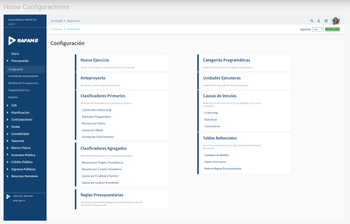
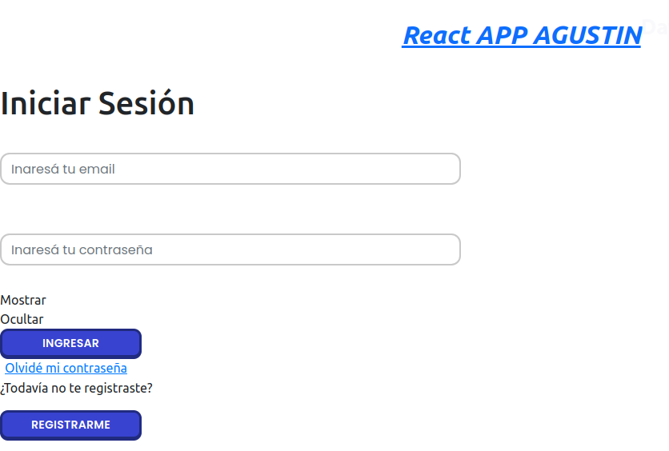
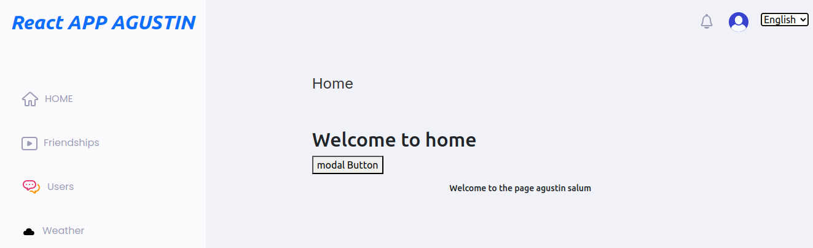

# Frontend Challenge

Thank you for taking up the challenge. We want to learn more about your skills. Our challenge for you is to create a minimal page. You will need to focus on design and try to replicate everything you can. The buttons do not need to be functional. Focus on creating reusable components, but try not to over-componentize.

## Design

You can check the design at the following link:  
[Figma Design](https://www.figma.com/file/0ZLi7UUCB4hOQQllTmtgG6/Prueba?node-id=1%3A212)



## API Integration

We want to integrate an API to see how the climate is doing. We need to know the daily maximum and minimum temperatures. You can use the following API:  
[Open Meteo API](https://api.open-meteo.com)

Don’t forget to add the GMT timezone and display this information somewhere on the site.

## Extra Points

- Implement a custom hook for fetching climate data.
- Implement Jest for testing.
- Implement a modal using Material UI.
- Use i18n translations. Only one language.
- Implement a fake login and store fake user data in `sessionStorage`. Protect the only page you have; if the user is logged in, they should be able to access the page. Provide a username and password for testing.

## Starting Repository

This is the repository for you to start with. Feel free to use any existing components and edit them if you wish:  
[GitHub Repository](https://github.com/lflescano/front-codechallenge)

## Tips

- Don’t worry if you don’t finish everything. Do your best and explain what can be improved.
- Once you finish, reply to the email with the link to your repository (public repo) along with your test.

Good luck!


# Frontend Instructions

## Dependencies
 - Node
 - NPM

## Instructions
 - Clone repo
 - cd to project folder
 - Install Node y NPM usando NVM. Version 12 en adelante
 - --- yarn install or npm install
 - cp .env.example .env
 - Configure the API route

## SO Windows
 - Edit package.json section "scripts"."start" with:
 `"start": "react-scripts start",`
 - Edit manually `src/environment.js`. Dont use `window._env_.REACT_APP_PRODUCTION`
 - DONT COMMIT CHANGES

## Dev Run with Yarn
 - yarn start
 - Access https://localhost:3000
## Dev Run with Npm
 - npm run start
 - Access https://localhost:3000

## Storybook Run
 - npm run storybook or yarn storybook
 - Access https://localhost:9009

## Prod Build
 - npm run build or yarn build

## Docker 

### Build
sudo docker build -t front .

### Run
sudo docker run --name front -p 3000:80 front

add "-d" to run in background

### Run with different variables
sudo docker run -p 3000:80 -e REACT_APP_API=https://backend.com.ar front

### Info
https://github.com/kunokdev/cra-runtime-environment-variables

# Execution

We need to install Node and NPM using NVM. Node should be set to version 12.

## Installation

1. **Install NVM**

   - First, ensure your system is up-to-date by running the following command:

     ```bash
     sudo apt update
     ```

   - Download and Install NVM:

     ```bash
     curl -o- https://raw.githubusercontent.com/nvm-sh/nvm/v0.35.3/install.sh | bash
     ```

   - Verify the NVM version installed with:

     ```bash
     nvm --version
     ```

2. **Install Node.js and NPM using NVM**

   - Install Node.js version 12:

     ```bash
     nvm install 12
     ```

   - Verify the Node.js and NPM versions:

     ```bash
     node --version
     npm --version
     ```

## Running the Project

1. **Install Project Dependencies**

   - Navigate to the project directory and install the required dependencies:

   ```bash
   npm install

2. **Start the Development Server**

   - Create your .env file
   
      ```
      cp .env.example .env
      ```
   
   - Make sure to use version 12 of nvm:
   
      ```
      nvm use 12
      ```
   
      - Once the dependencies are installed, start the development server with:
    
      ```
      npm run start
      ```

    Once the server is open, you should see the following screen:

      
      
    You must enter the credentials "useragustin" and "passagustin" to access the home page:

      


    - Start the Storybook server, a tool for developing and testing user interface components in isolation:

      ```
      npm run storybook
      ```

      - Create an optimized production version of your application:

      ```
      npm run build
      ```

    - Build a Docker image named front from the Dockerfile located in the current directory:

      ```
      sudo docker build -t front .
      ```

    - This command runs a Docker container based on the front image:

      ```
      sudo docker run --name front -p 3000:80 front
       ```

    You can add the -d flag to run the container in detached mode, allowing it to run in the background while you continue using the terminal for other commands.

    - This command runs a Docker container with an additional environment variable (REACT_APP_API) set. The REACT_APP_API variable is configured with the value https://backend.com.ar, which can be used by the application to configure the backend URL or other specific settings:

    ```
    sudo docker run -p 3000:80 -e REACT_APP_API=https://backend.com.ar front
    ```

# Project structure

- **`docs/`**: Project documentation, including files such as the main index.
- **`node_modules/`**: Is a directory where npm (Node Package Manager) installs project dependencies and packages.
- **`src/`**: Contains the source code for the React application, including components, styles, and other resources..
  - **`Components/`**: Contains all the reusable components of the application, organized into different categories based on their complexity and usage.
      - **`atoms/`**: Basic, indivisible UI elements like buttons, inputs, and labels. They are the smallest building blocks of the interface.
      - **`molecules/`**:  Groupings of atoms that form more complex components, such as a form input with a label and error message.
      -  **`organisms/`**: Larger components made up of molecules and atoms, such as navigation bars or user profile sections, that represent distinct sections of the UI.
      - **`templates/`**: Layouts that define the structure of pages by combining organisms and setting up the general arrangement of components for different views.
  - **`helpers/`**: Contains utility functions and helper methods that assist with common tasks and operations throughout the application.
  - **`hooks/`**: Contains custom React hooks that encapsulate reusable logic and side effects for use across different components.
  - **`models/`**: Defines data structures and schemas for the application's entities, often used in conjunction with APIs or state management.
  - **`services/`**: Contains functions and classes that handle interactions with external services or APIs, encapsulating data fetching and business logic.
  - **`store/`**: Houses the state management logic, including Redux or other state management libraries, to manage global state across the application.
  - **`translations/`**: Includes files and resources for internationalization (i18n), managing and providing translations for different languages.
  - **`views/`**: Contains page-level components or containers that represent distinct views or pages in the application, often combining various components.
  - **`app.js`**: The main entry point of the application, typically where the root component is rendered and the application's overall configuration is set up.
  - **`i18n.js`**: Configures and initializes internationalization settings, including the setup of translation resources and language management.

- **`.gitignore`**: File that specifies the files and directories that Git should ignore.

- **`README.md`**: File with the main information about the project.

# Completed tasks

## Implementation of Buenos Aires Weather State

The functionality to display the weather state in Buenos Aires has been integrated using the Open Meteo API.

1. **Creation of the Custom Hook: useWeatherData (src/hooks/useWeatherData.js)**

   A custom hook was created to handle the API request to Open Meteo using Buenos Aires' coordinates. This hook manages the request state, including data loading (`loading`), data reception (`weatherData`), and error handling (`error`).

2. **Creation of the Display Component: WeatherDisplay (src/components/molecules/WeatherDisplay/WeatherDisplay.js)**

   A component was created that uses the `useWeatherData` hook to display the weather state in Buenos Aires. The component manages data loading and errors, and shows relevant weather information such as maximum and minimum temperatures and the time zone.

3. **Creation of the Weather View: WeatherView (src/views/Weather/WeatherView.js)**

   A new view was created that combines the existing structure with the `WeatherDisplay` component. This view provides a more structured environment to display the weather information, maintaining consistency with the overall design of the application.

4. **Integration of the Route (src/app.js)**

   A new route was added in the `src/app.js` file to display the `WeatherView` when the user navigates to the `/weather` route.

5. **Integration of the Button in the Sidebar (src/components/molecules/Sidebar/index.js)**

   A button was added to the sidebar that redirects to the weather view (`/weather`). The button is designed to integrate with the existing layout and includes a representative weather icon.


## Modal Implementation

A modal is a UI component that overlays the main content to display additional information or request user action.

1. **Dependency Installation**
   
   ```bash
   npm install @mui/material @emotion/react @emotion/styled
   ```

2. **Component Creation (src/components/organisms/MyModal/CustomModal.js)**

   - A reusable modal component was created to manage open and close actions through props and applies custom styles.

3. **Modification of index.js in List (src/components/templates/List/index.js)**

   - Support was added to include additional content, such as the modal button, within the List component.

4. **Modification of HomeView (src/views/Home/HomeView.js)**

   - The `CustomModal` component was integrated into the Home view.

## Translation and Language Setup Documentation

This section describes the implementation of translation in the application using `i18next`, including language setup and integration into components.

### **Dependency Installation**

   ```bash
   npm install i18next i18next-browser-languagedetector react-i18next
   ```

### Modified Files

1. **Configuration of i18next (src/i18n.js)**

   `i18next` has been configured to handle translations and detect the user's browser language. Translations are loaded from JSON files, and a default language is set if no other language is detected.

   - **Language Detection:** Uses `i18next-browser-languagedetector` to detect the user's browser language. If no compatible language is detected, the default language ("es") is used.

2. **Integration into Home View (src/views/Home/HomeView.js)**

   `i18next` has been integrated into the Home view. The `useTranslation` hook is used to access translations and display text in the user's selected language.

   - **Note:** Similar integrations were made in other files requiring translation.

3. **Addition of Spanish Translations (src/translations/es/common.json)**

   This file contains Spanish translations used in the application. It includes texts for the modal title, the button to open the modal, and the welcome message.


## Manual Translation

Improvements have been made to the application's language management, allowing users to select between English and Spanish. Below are the details of the changes made to specific files.

1. **Update of i18n Configuration (src/i18n.js)**

   The i18n configuration has been updated to support both English and Spanish. The language detector has been implemented to handle the default language of the browser and allow manual changes.

2. **Creation of Language Selector Component (src/components/atoms/LanguageSelector/LanguageSelector.js)**

   A new `LanguageSelector` component has been created, allowing users to choose between English and Spanish via a dropdown menu. This component manages language changes and updates the i18n configuration accordingly.

3. **Integration into Base Header (src/components/atoms/BaseHeader/index.js)**

   The `LanguageSelector` component has been added to the `BaseHeader`. The language selector is now integrated and visible at the top of the user interface.

4. **Update of English Translations (src/translations/en/common.js)**

   The English translations have been updated to ensure that all application texts are correctly translated.

## sessionStorage

### Introduction

This section describes the implementation of a simple authentication system, including the use of protected routes that restrict access to authenticated users only.

### Modified Files

1. **Integration of ProtectedRoute in the Main Application (src/app.js)**

   The main application file was modified to include the `ProtectedRoute` component, which handles protected routes. It checks if the user is authenticated and manages redirections as necessary.

   - **Route Protection:** The `ProtectedRoute` component is used to wrap routes that require authentication, redirecting unauthenticated users to the login page.

2. **Creation of ProtectedRoute Component (src/components/molecules/ProtectedRoute/ProtectedRoute.js)**

   This file defines the `ProtectedRoute` component, which is responsible for determining if a user has access to a route based on their authentication status.

   - **Authentication Verification:** If the user is not logged in, they are redirected to the login page.

3. **Implementation of the Login Form (src/components/organisms/Login/Login.js)**

   The login form is implemented in this file. It validates the user's credentials and, upon successful authentication, saves the user's session in `sessionStorage`.

   - **Session Management:** The user's session is stored in `sessionStorage`, allowing them to remain logged in even after refreshing the page.

4. **Development of AuthService (src/services/AuthService.js)**

   This service handles all tasks related to authentication, including logging in the user, verifying their authentication status, and managing their session.

   - **Login Function:** It validates the user's credentials and manages session storage to track if the user is authenticated.

5. **Creation of the Sign-In View (src/views/Auth/Login/SignInView.js)**

   This view contains the login form and manages interaction with `AuthService` to authenticate the user and redirect them to the protected home page after a successful login.

   - **Redirection:** After a successful login, the user is redirected to the `/home` route, which is a protected route.

# Contact

If you have any questions or suggestions, feel free to contact me via my email.